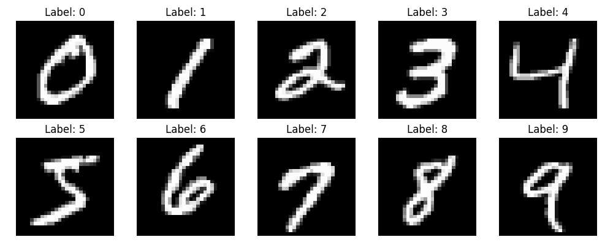
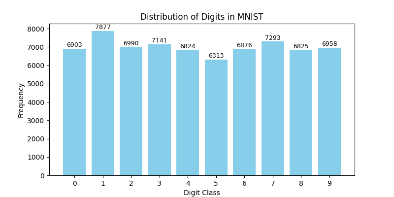

# Classification: การแยกประเภทตัวเลขที่เขียนด้วยลายมือ (MNIST Dataset)

**ประเภท:** [[00_Supervised_Learning_MOC|Supervised Learning]] > Classification (Multiclass)
**โฟลเดอร์:** `01_Classification_MNIST`
**เป้าหมาย:** สร้างโมเดลที่สามารถแยกแยะว่าภาพตัวเลขที่เขียนด้วยลายมือ (0-9) คือเลขอะไร

---

## 📊 การสำรวจและวิเคราะห์ข้อมูล (EDA - Exploratory Data Analysis)

MNIST (Modified National Institute of Standards and Technology) เป็นชุดข้อมูลยอดนิยมเปรียบเสมือน "Hello World" ของวงการ Machine Learning
ชุดข้อมูลนี้ประกอบด้วยภาพตัวเลขที่เขียนด้วยลายมือจำนวนทั้งหมด **70,000 ภาพ** โดยแบ่งเป็น:
- **Training Set:** 60,000 ภาพ (สำหรับสอนโมเดล)
- **Test Set:** 10,000 ภาพ (สำหรับทดสอบความแม่นยำ)

### 1. โครงสร้างของข้อมูล (Data Structure)
- **Features (X):** แต่ละภาพมีขนาด **28 x 28 พิกเซล** เมื่อคลี่ออกมาเป็น 1 มิติ (Flatten) จะได้อาเรย์ขนาด **784 Features** แต่ละพิกเซลเก็บค่าความสว่างตั้งแต่ `0` (สีดำ) ถึง `255` (สีขาว)
- **Label (y):** คำตอบที่ถูกต้อง เป็นตัวเลขตั้งแต่ `0` ถึง `9` (ทั้งหมด 10 คลาส)

### 2. ตัวอย่างภาพใน Dataset
ด้านล่างนี้คือตัวอย่างของตัวเลขที่ดึงออกมาจากชุดข้อมูล MNIST:



*ข้อสังเกต:* ลายมือของแต่ละคนมีความแตกต่างกันอย่างมาก บางคนเขียนเอียง บางคนเขียนเส้นหนา ทำให้โมเดลต้องเรียนรู้ลักษณะเด่น (Features) ที่แท้จริงของแต่ละตัวเลข

### 3. การกระจายตัวของข้อมูล (Class Distribution)
ชุดข้อมูลนี้ค่อนข้างสมดุล (Balanced Dataset) โดยแต่ละตัวเลข (0-9) จะมีจำนวนภาพใกล้เคียงกันที่ประมาณ 6,000-7,000 ภาพ ทำให้เราสามารถใช้ **Accuracy (ความแม่นยำรวม)** เป็นเกณฑ์วัดผลได้โดยตรง



---

## 💻 อัลกอริทึมสำหรับจำแนก MNIST พร้อมตัวโค้ด

ในการแก้ปัญหา MNIST เราสามารถเลือกระดับความซับซ้อนของอัลกอริทึมได้ตามความเหมาะสม ด้านล่างนี้คือ 3 อัลกอริทึมยอดนิยม เรียงจากพื้นฐานไปจนถึงขั้นสูง

### ขั้นตอนเตรียมข้อมูล (ใช้งานร่วมกัน)
```python
import numpy as np
from sklearn.datasets import fetch_openml
from sklearn.model_selection import train_test_split

print("กำลังโหลดข้อมูล MNIST...")
mnist = fetch_openml('mnist_784', version=1, as_frame=False)
X, y = mnist["data"], mnist["target"].astype(int)

# แบ่งข้อมูล Train และ Test
X_train, X_test, y_train, y_test = train_test_split(X, y, test_size=10000, random_state=42)
```

---

### 1. Logistic Regression (แบบ Multinomial / Softmax)
**แนวคิด:** เป็นโมเดลพื้นฐานที่ใช้สมการเชิงเส้นในการคำนวณความน่าจะเป็นของแต่ละตัวเลข
- **ข้อดี:** เทรนได้รวดเร็วมาก ใช้ทรัพยากรน้อย
- **ข้อเสีย:** ไม่สามารถจับรูปแบบความโค้งหรือลวดลายที่ซับซ้อน (Non-linear) ของรูปภาพได้ดีเท่าโมเดลอื่น

```python
from sklearn.linear_model import LogisticRegression
from sklearn.metrics import accuracy_score

print("กำลังเทรน Logistic Regression...")
log_clf = LogisticRegression(max_iter=1000, solver='lbfgs', multi_class='multinomial')
log_clf.fit(X_train, y_train)

y_pred_log = log_clf.predict(X_test)
print(f"ความแม่นยำ (Logistic Regression): {accuracy_score(y_test, y_pred_log):.4f}")
```

### 2. K-Nearest Neighbors (KNN)
**แนวคิด:** พิจารณาจาก "เพื่อนบ้านที่ใกล้ที่สุด" โดยนำภาพใหม่ไปเทียบพิกัดพิกเซลกับภาพทั้งหมดในข้อมูลฝึกสอน และโหวตว่าหน้าตาคล้ายเลขอะไรมากที่สุด
- **ข้อดี:** ไม่ต้องมีสมการซับซ้อน ให้ความแม่นยำค่อนข้างดี (ประมาณ 97%)
- **ข้อเสีย:** ตอนทำนายผล (Predict) จะทำงานช้ามาก เพราะต้องคำนวณระยะห่างกับข้อมูลทุกรูปในฐานข้อมูล

```python
from sklearn.neighbors import KNeighborsClassifier
from sklearn.metrics import accuracy_score

print("กำลังเทรน K-Nearest Neighbors (KNN)...")
knn_clf = KNeighborsClassifier(n_neighbors=3, weights='distance')
knn_clf.fit(X_train, y_train)

y_pred_knn = knn_clf.predict(X_test)
print(f"ความแม่นยำ (KNN): {accuracy_score(y_test, y_pred_knn):.4f}")
```

### 3. Convolutional Neural Network (CNN)
**แนวคิด:** เป็น [[Convolutional_Neural_Networks|Deep Learning]] ที่ออกแบบมาเพื่อข้อมูลภาพโดยเฉพาะ โดยใช้แผ่นฟิลเตอร์กวาดเพื่อตรวจจับเส้นขอบ มุม และลวดลาย
- **ข้อดี:** ให้ความแม่นยำสูงที่สุด (สามารถทำได้ถึง 99%+)
- **ข้อเสีย:** ต้องใช้เวลาเทรนนาน การตั้งค่าซับซ้อน ควรมี GPU 

```python
import tensorflow as tf
from tensorflow.keras import layers, models

# ปรับขนาดข้อมูลให้เป็น 2 มิติ (28x28) และเพิ่มช่องสี (1 channel)
X_train_cnn = X_train.reshape(-1, 28, 28, 1) / 255.0
X_test_cnn = X_test.reshape(-1, 28, 28, 1) / 255.0

print("กำลังสร้างโมเดล CNN...")
cnn_model = models.Sequential([
    layers.Conv2D(32, (3, 3), activation='relu', input_shape=(28, 28, 1)),
    layers.MaxPooling2D((2, 2)),
    layers.Conv2D(64, (3, 3), activation='relu'),
    layers.MaxPooling2D((2, 2)),
    layers.Flatten(),
    layers.Dense(64, activation='relu'),
    layers.Dense(10, activation='softmax')
])

cnn_model.compile(optimizer='adam', loss='sparse_categorical_crossentropy', metrics=['accuracy'])

# ฝึกสอนโมเดล (ใช้ 5 Epoch)
cnn_model.fit(X_train_cnn, y_train, epochs=5, validation_split=0.1)

test_loss, test_acc = cnn_model.evaluate(X_test_cnn, y_test, verbose=2)
print(f"\nความแม่นยำ (CNN): {test_acc:.4f}")
```

---

## 💡 สิ่งที่ควรทราบ
- **การเลือกใช้โมเดล:** 
  - ถ้าต้องการโมเดลพื้นฐานไวๆ ให้เลือก **Logistic Regression**
  - ถ้าต้องการความเข้าใจง่ายแต่แม่นยำระดับกลาง ให้เลือก **KNN**
  - ถ้ารับมือกับข้อมูลภาพแบบจริงจังและต้องการความแม่นยำสูงสุด ให้เลือก **CNN**
- **ปัญหาท้าทาย:** การแยกแยะตัวเลขที่มีความคล้ายคลึงกัน (เช่น 4 กับ 9 หรือ 3 กับ 8) มักจะเป็นส่วนที่โมเดลมีข้อผิดพลาด สามารถเช็คได้จาก Confusion Matrix

#machinelearning #supervised #classification #mnist #eda #cnn #knn #logistic_regression
