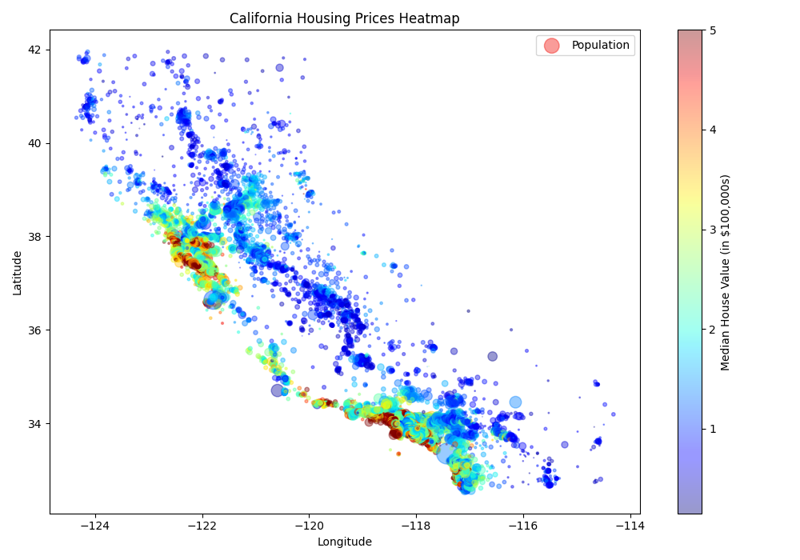
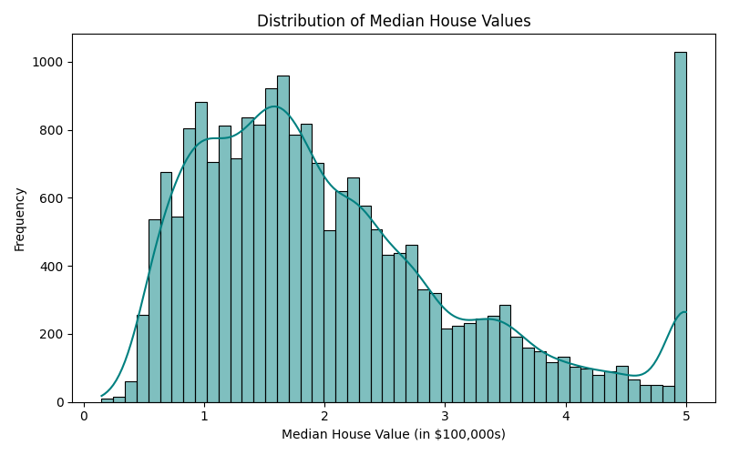
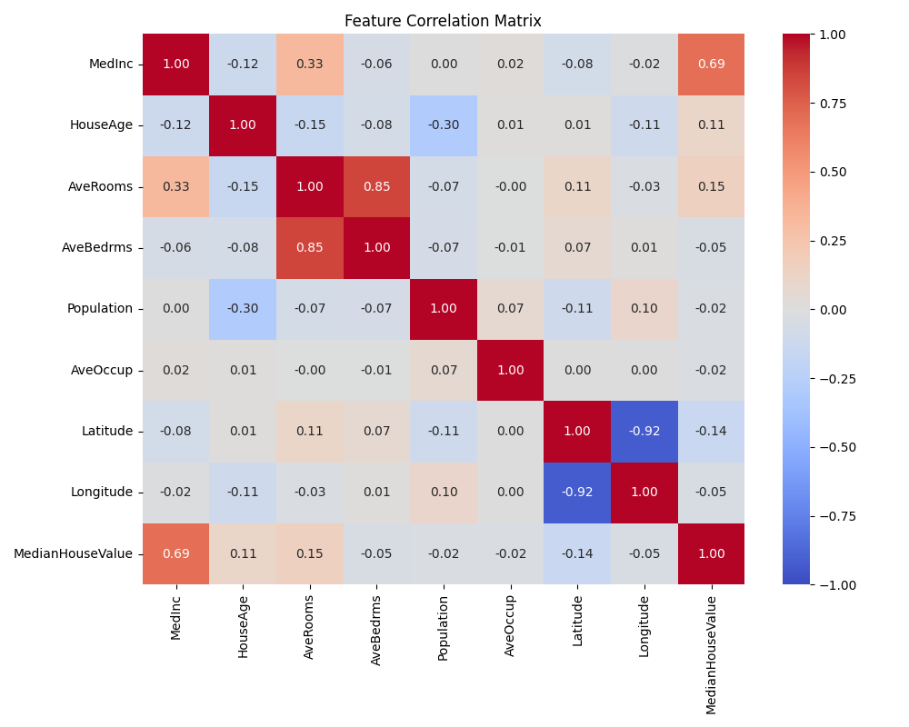

# Regression: การทำนายราคาบ้าน (California Housing Dataset)

**ประเภท:** [[00_Supervised_Learning_MOC|Supervised Learning]] > Regression (Multiple Regression)
**โฟลเดอร์:** `02_Regression_California_Housing`
**เป้าหมาย:** สร้างโมเดลเพื่อทำนาย "ราคากลางของบ้าน" (Median House Value) ในแต่ละเขต (Block Group) ของรัฐแคลิฟอร์เนีย

---

## 📊 การสำรวจและวิเคราะห์ข้อมูล (EDA - Exploratory Data Analysis)

ชุดข้อมูล **California Housing** มักถูกใช้เป็นตัวอย่างหลักในการเรียนโจทย์ประเภท Regression ข้อมูลนี้รวบรวมมาจากการสำรวจสำมะโนประชากรของรัฐแคลิฟอร์เนียในปี 1990 มีทั้งหมด **20,640 แถว** (1 แถวแทน 1 เขต หรือ Block Group ซึ่งมีคนอยู่ประมาณ 600-3,000 คน)

### 1. โครงสร้างของข้อมูล (Data Structure)
- **Features (X):** มี 8 ตัวแปร ได้แก่
  1. `MedInc`: รายได้เฉลี่ยของคนในเขตนั้น (หน่วยหมื่นดอลลาร์)
  2. `HouseAge`: อายุบ้านเฉลี่ยในเขตนั้น
  3. `AveRooms`: จำนวนห้องเฉลี่ยต่อบ้าน
  4. `AveBedrms`: จำนวนห้องนอนเฉลี่ยต่อบ้าน
  5. `Population`: จำนวนประชากรในเขตนั้น
  6. `AveOccup`: จำนวนคนเฉลี่ยต่อบ้าน
  7. `Latitude`: ละติจูด (พิกัดแนวตั้ง)
  8. `Longitude`: ลองจิจูด (พิกัดแนวนอน)
- **Label (y):** `MedianHouseValue` (ราคากลางของบ้าน) มีหน่วยเป็น แสนดอลลาร์สหรัฐ ($100,000)

---

### 2. แผนที่ราคาบ้าน (Geographical Scatter Plot)
ถ้าเรานำพิกัด Latitude และ Longitude มาพล็อต และใช้สีแทนราคาบ้าน เราจะเห็นภาพของรัฐแคลิฟอร์เนียได้อย่างชัดเจน โดยจุดสีแดง/น้ำตาลคือเขตที่มีราคาบ้านสูง (เช่น อ่าวซานฟรานซิสโก และ ลอสแอนเจลิส) ส่วนขนาดของจุดแทนจำนวนประชากร



### 3. การกระจายตัวของราคาบ้าน (Distribution of Target Variable)
เมื่อดู Histogram ของราคาบ้าน เราจะพบว่ามีการกระจายตัวคล้ายระฆังคว่ำ (Normal Distribution) แต่มี **จุดยอดผิดปกติที่ฝั่งขวาสุด (ราคา 5 แสนดอลลาร์)** ซึ่งเกิดจากการที่ระบบเก็บข้อมูลจำกัดเพดานราคาสูงสุดไว้ที่ $500,000 (Capped) 



### 4. ความสัมพันธ์ระหว่างตัวแปร (Correlation Heatmap)
จากตารางความสัมพันธ์เชิงเส้นด้านล่าง เราสามารถวิเคราะห์เบื้องต้นได้ว่า:
- `MedInc` (รายได้เฉลี่ย) มีความสัมพันธ์เชิงบวกสูงสุด (0.69) กับ `MedianHouseValue` (ราคาบ้าน) หมายความว่ายิ่งย่านไหนคนรวย บ้านก็ยิ่งแพง!
- `AveRooms` มีความสัมพันธ์กับ `MedInc` ค่อนข้างสูง



---

## 💻 อัลกอริทึมสำหรับทำนายราคาบ้านพร้อมตัวอย่างโค้ด

เนื่องจากข้อมูลมีความซับซ้อนและมีความสัมพันธ์เชิงพื้นที่ (พิกัดแผนที่) การเลือกใช้อัลกอริทึมจึงส่งผลต่อความแม่นยำอย่างมาก ด้านล่างนี้คือ 3 อัลกอริทึมยอดนิยมสำหรับ Regression

### ขั้นตอนเตรียมข้อมูล (ใช้งานร่วมกัน)
```python
import pandas as pd
import numpy as np
from sklearn.datasets import fetch_california_housing
from sklearn.model_selection import train_test_split
from sklearn.metrics import mean_squared_error, r2_score

print("กำลังโหลดข้อมูล California Housing...")
housing = fetch_california_housing()
X = pd.DataFrame(housing.data, columns=housing.feature_names)
y = housing.target

# แบ่งข้อมูล Train (80%) และ Test (20%)
X_train, X_test, y_train, y_test = train_test_split(X, y, test_size=0.2, random_state=42)

# ฟังก์ชันสำหรับประเมินผล
def evaluate_model(name, y_true, y_pred):
    rmse = np.sqrt(mean_squared_error(y_true, y_pred))
    r2 = r2_score(y_true, y_pred)
    print(f"[{name}] RMSE: {rmse:.4f} (${rmse*100000:,.0f}) | R-squared: {r2:.4f}")
```

---

### 1. Multiple Linear Regression
**แนวคิด:** สร้างสมการเส้นตรงที่ให้น้ำหนัก (Weight) กับแต่ละ Feature เพื่อหาผลลัพธ์
- **ข้อดี:** ทำงานเร็วมาก อธิบายที่มาที่ไปของสมการได้ง่าย
- **ข้อเสีย:** ไม่สามารถทำความเข้าใจความสัมพันธ์แบบโค้งหรือซับซ้อนได้ (เช่น ไม่รู้ว่าพิกัด Latitude/Longitude รวมกันแล้วคือทำเลทอง)

```python
from sklearn.linear_model import LinearRegression

print("\nกำลังเทรน Linear Regression...")
lin_reg = LinearRegression()
lin_reg.fit(X_train, y_train)

y_pred_lin = lin_reg.predict(X_test)
evaluate_model("Linear Regression", y_test, y_pred_lin)
```

### 2. Random Forest Regressor
**แนวคิด:** สร้างต้นไม้ตัดสินใจ (Decision Trees) จำนวนมากแบบสุ่ม แล้วนำผลลัพธ์การทำนายของทุกต้นมาหาค่าเฉลี่ย
- **ข้อดี:** สามารถจัดการกับข้อมูลที่ซับซ้อนและไม่ได้เป็นเส้นตรงได้ดีเยี่ยม โดยเฉพาะข้อมูลพิกัด (Lat/Long) ไม่ค่อยสนใจ Outlier มากนัก
- **ข้อเสีย:** ใช้เวลาเทรนนานกว่าโมเดลพื้นฐาน และไฟล์โมเดลมีขนาดใหญ่

```python
from sklearn.ensemble import RandomForestRegressor

print("\nกำลังเทรน Random Forest...")
# กำหนด n_estimators=100 คือใช้ต้นไม้ 100 ต้น
rf_reg = RandomForestRegressor(n_estimators=100, random_state=42, n_jobs=-1)
rf_reg.fit(X_train, y_train)

y_pred_rf = rf_reg.predict(X_test)
evaluate_model("Random Forest", y_test, y_pred_rf)
```

### 3. Gradient Boosting Regressor (XGBoost / HistGradientBoosting)
**แนวคิด:** สร้างต้นไม้ตัดสินใจทีละต้น โดยต้นใหม่ที่สร้างขึ้นจะโฟกัสไปที่การแก้ไข "ข้อผิดพลาด (Errors)" ของต้นก่อนหน้า
- **ข้อดี:** มักจะให้ความแม่นยำสูงสุด (State-of-the-Art) สำหรับข้อมูลแบบตาราง (Tabular data) ชนะการแข่งขันบ่อยครั้ง
- **ข้อเสีย:** ต้องจูน Hyperparameter เยอะ เสี่ยงต่อการเกิด Overfitting ได้ง่ายถ้าตั้งค่าไม่ดี

```python
from sklearn.ensemble import HistGradientBoostingRegressor

print("\nกำลังเทรน Gradient Boosting...")
# ใช้ HistGradientBoosting ซึ่งทำงานได้เร็วกว่า GradientBoosting ปกติมากในข้อมูลขนาดใหญ่
gb_reg = HistGradientBoostingRegressor(random_state=42)
gb_reg.fit(X_train, y_train)

y_pred_gb = gb_reg.predict(X_test)
evaluate_model("Gradient Boosting", y_test, y_pred_gb)
```

---

## 💡 สิ่งที่ควรทราบ
- การประเมินผลสำหรับ Regression จะใช้ค่า **RMSE (Root Mean Squared Error)** ยิ่งน้อยยิ่งดี เพราะเป็นการวัดว่าโมเดลทำนายพลาดไปเฉลี่ยเท่าไหร่
- หากลองรันโค้ดด้านบน จะพบว่า **Linear Regression** ทำ RMSE ได้ประมาณ $72,000 ในขณะที่ **Random Forest** และ **Gradient Boosting** จะทำได้ดีกว่ามาก (ผิดพลาดน้อยกว่า $50,000) เพราะโมเดลแบบ Tree สามารถเรียนรู้กลุ่มพิกัดละติจูดและลองจิจูดร่วมกันได้

#machinelearning #supervised #regression #california_housing #eda #linear_regression #random_forest #gradient_boosting
