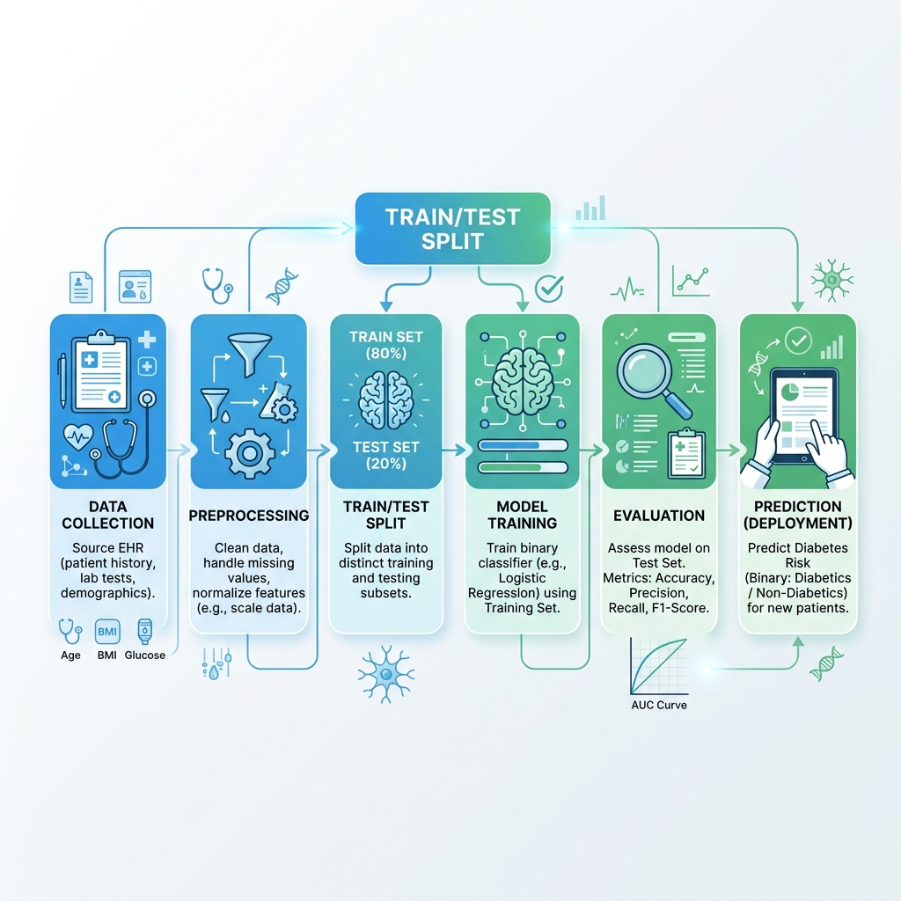

# Binary Classification Pipeline: Diabetes Prediction (ทำนายความเสี่ยงโรคเบาหวาน)

การทำ Classification แบบสองคลาส (Binary Classification) มีขั้นตอนมาตรฐานในการนำข้อมูลตาราง (Tabular Data) เช่นไฟล์ CSV มาประมวลผลจนได้เป็นโมเดลที่สามารถทำนายผลได้ โดยอิงจากตัวอย่าง "โจทย์ความเสี่ยงโรคเบาหวาน" จะมีขั้นตอนดังนี้:

---

## Diagram ขั้นตอนการประมวลผล (Machine Learning Pipeline)

```mermaid
flowchart TD
    A[1. นำเข้าข้อมูล\n(Load CSV Dataset)] --> B(2. สำรวจและเตรียมข้อมูล\nEDA & Preprocessing)
    B --> C(3. แบ่งชุดข้อมูล\nTrain / Test Split)
    
    C -->|ชุดสอน 80%| D(4. ฝึกสอนโมเดล\nModel Training)
    C -->|ชุดทดสอบ 20%| E(5. ประเมินโมเดล\nModel Evaluation)
    
    D --> E
    
    E --> F{ประเมินผลผ่านเกณฑ์?}
    F -->|ไม่ผ่าน (ปรับจูนใหม่)| B
    F -->|ผ่าน| G([6. นำไปใช้งานจริง\nPrediction / Inference])
    
    style A fill:#e1f5fe,stroke:#039be5
    style G fill:#e8f5e9,stroke:#43a047
```

<div align="center">
  
</div>

---

## รายละเอียดแต่ละขั้นตอน (ประยุกต์ใช้กับโจทย์ Diabetes)

### 1. การนำเข้าข้อมูล (Data Collection & Loading)
* โหลดไฟล์ `diabetes_binary_classification.csv` ที่มี **Features (ตัวแปรต้น)** ได้แก่ `Age`, `BMI`, `BloodPressure`, `Glucose` และ **Target (ตัวแปรตาม)** คือ `Outcome` (0 = ไม่เป็น, 1 = เสี่ยงเป็น)

### 2. การสำรวจและเตรียมข้อมูล (EDA & Preprocessing)
* **การสำรวจ (EDA):** ตรวจดูว่ามีค่าว่าง (Missing Values) ไหม มีค่าไหนที่ผิดปกติ (เช่น ความดันติดลบ) หรือไม่
* **การทำ Data Scaling:** สำคัญมาก! เนื่องจากค่า `Glucose` (ระดับน้ำตาล) อาจอยู่ที่หลักร้อย (เช่น 120-160) แต่ `BMI` อยู่ที่หลักสิบ (เช่น 22-30) สเกลที่ต่างกันเกินไปจะทำให้โมเดลให้น้ำหนักผิดพลาด เราจึงต้องแปลงสเกลข้อมูลทุกคอลัมน์ให้อยู่ในระดับใกล้เคียงกัน (เช่น การทำ *Standardization* หรือ *Min-Max Scaling*)

### 3. การแบ่งชุดข้อมูล (Train / Test Split)
* กฎเหล็กของ Machine Learning คือ ห้ามนำข้อมูลทั้งหมดไปสอนโมเดลรวดเดียว ต้องแบ่งส่วนหนึ่งไว้ "สอบ" ด้วย เพื่อป้องกันไม่ให้โมเดลท่องจำ (Overfitting)
* **Train Set (เช่น 80%):** ให้โมเดลเรียนรู้หาความสัมพันธ์ของระดับน้ำตาล อายุ ฯลฯ ว่าส่งผลต่อโรคเบาหวานอย่างไร
* **Test Set (เช่น 20%):** เก็บคำตอบ `Outcome` ไว้ แล้วให้โมเดลลองทาย จากนั้นเอามาตรวจคำตอบทีหลัง

### 4. การฝึกสอนโมเดล (Model Training)
* เลือกอัลกอริทึมในหมวด **Supervised Learning** ที่ใช้สำหรับแบ่งคลาส (Classification) เช่น:
  * **Logistic Regression:** เรียบง่าย ทำงานรวดเร็ว เป็นบรรทัดฐาน (Baseline) ที่ดี
  * **Random Forest:** ตัดสินใจคล้ายมนุษย์ จัดการข้อมูลซับซ้อนได้ดี
  * **Support Vector Machine (SVM):** เก่งในการตีเส้นแบ่งเขตแดนระหว่าง 2 คลาส
* โมเดลจะทำการหา "สมการ" หรือ "เส้นแบ่งเขตแดน" (Decision Boundary) เพื่อแยกคนป่วยออกจากคนปกติ

### 5. การประเมินโมเดล (Model Evaluation)
* วัดผลจาก Test Set ที่กันไว้ด้วยเครื่องมือวัดผล (Metrics) ที่สำคัญ เช่น:
  * **Accuracy:** ทายถูกทั้งหมดกี่เปอร์เซ็นต์
  * **Confusion Matrix:** ดูพฤติกรรมการทายผิด *(ในกรณีโรคเบาหวาน การทายผิดว่า "ปกติ" ทั้งที่จริงๆ "ป่วย" (False Negative) ถือว่าอันตรายต่อคนไข้มาก จึงอาจต้องให้ความสำคัญกับค่า Recall เป็นพิเศษ)*

### 6. การทำนายผลข้อมูลใหม่ (Prediction / Inference)
* เมื่อโมเดลผ่านการประเมินว่ามีความแม่นยำเป็นที่น่าพอใจ เราสามารถนำข้อมูลของคนไข้รายใหม่ (เช่น อายุ 35, BMI 25, ความดัน 80, น้ำตาล 110) เข้าสู่โมเดล โมเดลจะตอบกลับมาทันทีว่าเป็น `0` (ปกติ) หรือ `1` (เสี่ยงเป็นเบาหวาน) เพื่อช่วยแพทย์ตัดสินใจต่อไป
