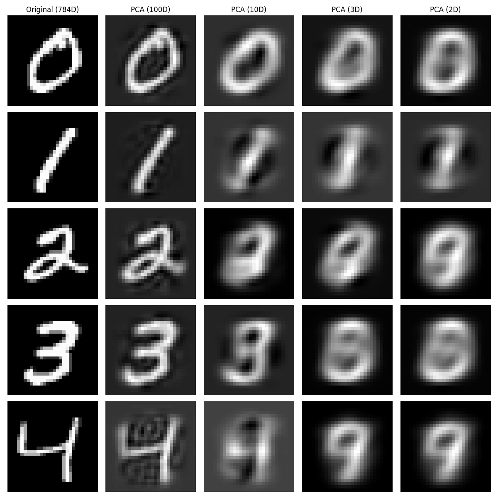

# PCA vs t-SNE: การแปลงข้อมูลกลับ (Reconstruction)

**ประเภท:** [[00_Unsupervised_Learning_MOC|Unsupervised Learning]] > Dimensionality Reduction
**โฟลเดอร์:** `01_Unsupervised_MNIST`
**เป้าหมาย:** เปรียบเทียบคุณสมบัติการลดมิติและการ "สร้างภาพกลับคืนมา (Reconstruction)" ของอัลกอริทึม PCA และอธิบายเหตุผลที่ t-SNE ไม่สามารถทำได้

---

## 🆚 ข้อแตกต่างสำคัญระหว่าง PCA และ t-SNE

เมื่อเราพูดถึงการลดมิติข้อมูล (Dimensionality Reduction) อัลกอริทึมแต่ละตัวมีเป้าหมายที่แตกต่างกัน:

1. **PCA (Principal Component Analysis):**
   - เป็นการแปลงข้อมูลแบบเชิงเส้น (Linear Projection) 
   - เก็บ "แก่น" ของข้อมูลไว้ในรูปแบบของสมการคณิตศาสตร์
   - **คุณสมบัติพิเศษ:** สามารถแปลงข้อมูลไปมาระหว่างมิติสูงและมิติต่ำได้ (มีฟังก์ชัน `inverse_transform`)
2. **t-SNE (t-Distributed Stochastic Neighbor Embedding):**
   - เป็นการแปลงข้อมูลแบบไม่เป็นเส้นตรง (Non-linear)
   - สร้างขึ้นมาเพื่อ "การวาดกราฟ (Visualization)" เท่านั้น โดยพยายามรักษาให้จุดที่คล้ายกันอยู่ใกล้กัน
   - **ข้อจำกัด:** ไม่มีการเก็บสมการความสัมพันธ์เอาไว้ จึง **ไม่สามารถแปลงข้อมูลกลับ (Cannot Reconstruct)** เป็นภาพต้นฉบับได้!

ดังนั้น ในการทดลองนี้ เราจะสามารถทำ Reconstruction ได้เฉพาะกับ **PCA** เท่านั้นครับ

---

## 🖼️ ผลลัพธ์การแปลงภาพกลับ (PCA Reconstruction)

เราจะนำภาพตัวเลขดั้งเดิม (784 มิติ) ไปบีบอัดด้วย PCA ให้เหลือมิติที่เล็กลง ได้แก่ **100, 10, 3, และ 2 มิติ** จากนั้นสั่งให้ PCA "จำลองภาพต้นฉบับกลับขึ้นมาใหม่" จากข้อมูลที่เหลืออยู่เพียงน้อยนิดนั้น



### 🔍 วิเคราะห์ผลลัพธ์จากภาพ:
- **PCA (100D):** ภาพที่แปลงกลับมาแทบจะเหมือนต้นฉบับเป๊ะๆ อาจจะเบลอขึ้นเล็กน้อยเท่านั้น (ข้อมูล 100 ตัวเลข สามารถแทน 784 พิกเซลได้ดีมาก)
- **PCA (10D):** เริ่มมองเห็นความเบลออย่างชัดเจน แต่สายตามนุษย์ยังพอแยกออกว่าคือตัวเลขอะไร
- **PCA (3D):** ข้อมูลสูญหายไปเยอะมาก ภาพเริ่มกลายเป็นเงารางๆ คล้ายกับการเอาตัวเลขหลายๆ ตัวมาซ้อนทับกัน
- **PCA (2D):** เมื่อเหลือแค่ 2 ตัวเลข (แกน X และ Y) เป็นไปไม่ได้เลยที่จะเก็บรายละเอียดของภาพไว้ได้ ภาพที่แปลงกลับมาจึงดูไม่ออกแล้วว่าเป็นเลขอะไร

---

## 💻 ตัวอย่างโค้ด (PCA Reconstruction)

```python
from sklearn.decomposition import PCA
import matplotlib.pyplot as plt

# สมมติว่า X_train มี 10,000 รูป และ X_sample เป็นรูปเลข 3 รูปเดียว
pca = PCA(n_components=10) # ลองลดเหลือ 10 มิติ
pca.fit(X_train)

# 1. ลดมิติข้อมูล (784 มิติ -> 10 มิติ)
X_reduced = pca.transform(X_sample)

# 2. แปลงข้อมูลกลับเป็นภาพ (10 มิติ -> 784 มิติ)
X_reconstructed = pca.inverse_transform(X_reduced)

# นำ X_reconstructed ไป reshape(28, 28) เพื่อวาดรูปด้วย plt.imshow
```

## 💡 สรุปการเลือกใช้งาน
- ใช้ **PCA** เมื่อคุณต้องการบีบอัดข้อมูล (Compression) เพื่อประหยัดพื้นที่ ลด Noise หรือเอาไปเข้า Machine Learning ต่อ โดยที่ยังสามารถกู้คืนข้อมูลเดิมกลับมาได้ (Lossy Compression)
- ใช้ **t-SNE** (หรือ UMAP) เมื่อคุณแค่อยากจะ **พล็อตกราฟดูด้วยตาเปล่า** ว่าข้อมูลแบ่งกลุ่มกันชัดเจนไหม 

#machinelearning #unsupervised #pca #tsne #reconstruction #mnist
