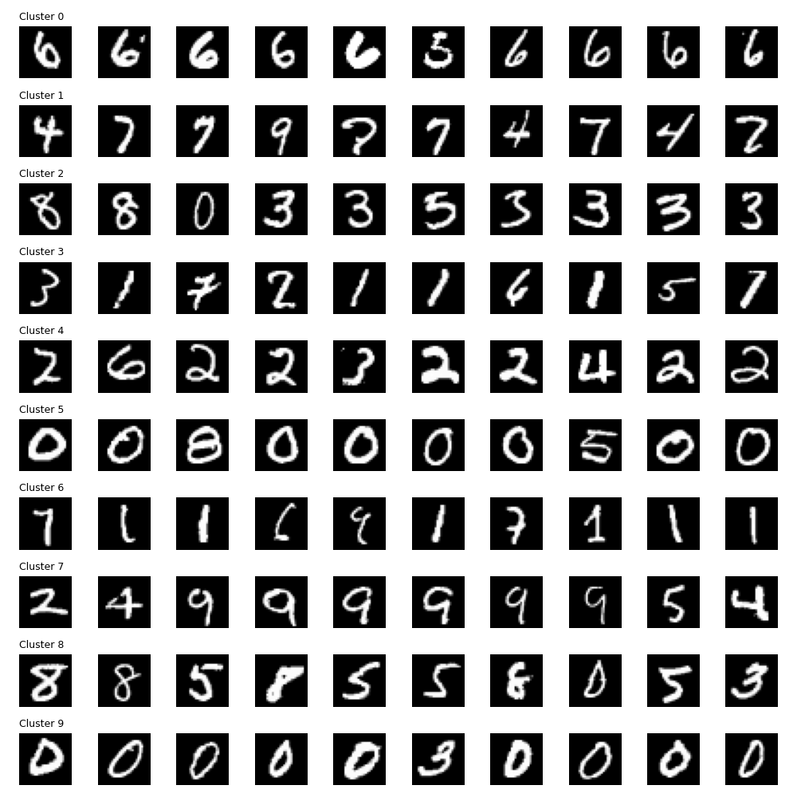
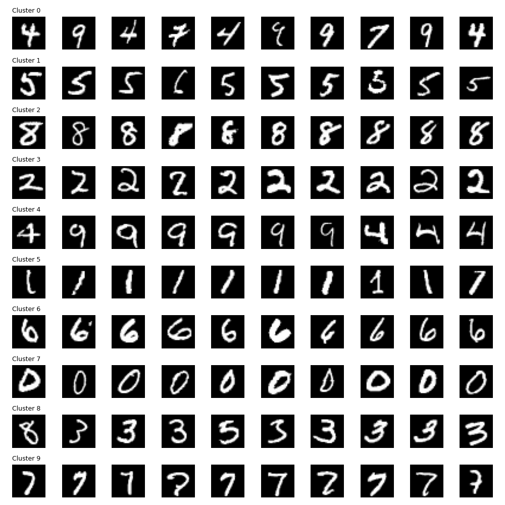

# การจัดกลุ่มตัวเลขจากการลดมิติ 20 มิติ (PCA) & เปรียบเทียบ PCA vs t-SNE

**ประเภท:** [[00_Unsupervised_Learning_MOC|Unsupervised Learning]]
**โฟลเดอร์:** `01_Unsupervised_MNIST`
**เป้าหมาย:** วิเคราะห์ผลลัพธ์ว่าหากเราลดมิติภาพเหลือ 20 มิติ แล้วสั่งให้ K-Means จัดกลุ่ม 10 กลุ่ม หน้าตาของตัวเลขในแต่ละกลุ่มจะเป็นอย่างไร? พร้อมเปรียบเทียบข้อดี-ข้อเสียของ PCA และ t-SNE

---

## 🖼️ ผลลัพธ์การจัดกลุ่ม (Clustering Results from 20D)

ในขั้นตอนทดลองนี้ เราทำ 2 อย่าง:
1. ใช้ **PCA ลดมิติรูปภาพจาก 784 พิกเซล ลงมาเหลือ 20 แกนหลัก (20 Dimensions)** เพื่อตัดตัวแปรที่ไม่จำเป็นออก
2. สั่งให้ **K-Means จัดกลุ่มข้อมูลเป็น 10 กลุ่ม (Clusters)** โดยที่ไม่ได้บอกว่าแต่ละรูปคือตัวเลขอะไร

รูปด้านล่างคือ **ตัวอย่างภาพ 10 ภาพแรกที่ถูกจัดอยู่ในแต่ละกลุ่ม (Cluster 0 ถึง 9)**:

### 🔍 วิเคราะห์จากภาพผลลัพธ์ (PCA 20 มิติ)
เมื่อมองด้วยตาเปล่า จะพบว่า K-Means สามารถดึงตัวเลขที่หน้าตาเหมือนกันไปอยู่กลุ่มเดียวกันได้ดีมาก (แม้เราจะลดมิติเหลือแค่ 20 แล้วก็ตาม)!
- กลุ่มบางกลุ่มมีความบริสุทธิ์สูงมาก เช่น **เลข 0**, **เลข 1**, หรือ **เลข 8** ที่จัดกลุ่มรวมกันได้ค่อนข้างเพอร์เฟกต์
- แต่จะมีบางกลุ่มที่ **เกิดความสับสน** ตัวอย่างที่พบบ่อยใน Unsupervised Learning กับ MNIST คือ:
  - **4 กับ 9:** มักจะถูกปนอยู่ในกลุ่มเดียวกัน เพราะโครงสร้างการลากเส้นด้านบนคล้ายกันมาก
  - **3 กับ 5:** มีโครงสร้างความโค้งที่คล้ายกัน
- สิ่งนี้ยืนยันว่า โมเดลเรียนรู้จาก **"รูปร่างของเส้น"** จริงๆ ไม่ใช่การเดา

---

## 🖼️ เปรียบเทียบผลลัพธ์การจัดกลุ่มด้วย t-SNE (2D)
เพื่อเปรียบเทียบประสิทธิภาพ เราได้ลองทำวิธีการตามกฎเหล็กของ Data Scientist คือ:
1. ลดมิติรูปภาพด้วย PCA ให้เหลือ 50 มิติ (ตัด Noise)
2. นำ 50 มิตินั้นไปลดต่อด้วย **t-SNE** ให้เหลือ **2 มิติ**
3. สั่งให้ K-Means จัดเป็น 10 กลุ่ม จากข้อมูล 2 มิตินี้

ด้านล่างคือ **ตัวอย่างภาพ 10 ภาพแรกที่ถูกจัดอยู่ในแต่ละกลุ่มของ t-SNE**:

### 🔍 วิเคราะห์เปรียบเทียบ (PCA vs t-SNE Clustering)
- **ความบริสุทธิ์ของกลุ่ม (Purity):** t-SNE ทำผลงานได้ **ดีกว่า PCA มาก** ในการแยกกลุ่มตัวเลข! กลุ่มของเลข 4, 9, 3, 5 ที่เคยปนกันใน PCA ถูกแยกออกจากกันได้ดีขึ้นอย่างชัดเจน
- **เหตุผล:** t-SNE ใช้วิธีการประเมินระยะห่างแบบ Non-linear ทำให้จุดที่หน้าตาคล้ายกันถูกดึงดูดเข้าหากันแน่นขึ้นบนกราฟ 2D และผลักจุดที่ต่างกันออกไปไกลๆ K-Means จึงสามารถตีกรอบแบ่งกลุ่มบนพื้นที่ 2D ของ t-SNE ได้ง่ายและแม่นยำกว่าการแบ่งกลุ่มบน 20D ของ PCA ที่เป็นเชิงเส้นตรง

---

## 🆚 เปรียบเทียบอัลกอริทึมลดมิติ: PCA vs t-SNE

ทั้ง PCA และ t-SNE เป็นอัลกอริทึมสำหรับ Dimensionality Reduction เหมือนกัน แต่มีเป้าหมายและหลักการทำงานที่ต่างกันอย่างสิ้นเชิง:

| คุณสมบัติ | PCA (Principal Component Analysis) | t-SNE (t-Distributed Stochastic Neighbor Embedding) |
| :--- | :--- | :--- |
| **จุดประสงค์หลัก** | รักษาความแปรปรวน (Variance) ของข้อมูลโดยรวมให้มากที่สุด | รักษาความสัมพันธ์ระยะใกล้ (Local Structure) ให้จุดที่คล้ายกันอยู่ใกล้กัน |
| **การใช้งานหลัก** | ใช้ลดมิติเพื่อเตรียมข้อมูลก่อนนำไปเทรนโมเดล (Feature Extraction) | ใช้สำหรับการวาดกราฟ 2D/3D ให้มนุษย์ดู (Visualization) เท่านั้น |
| **คณิตศาสตร์** | Linear (เชิงเส้น) | Non-linear (ไม่เป็นเชิงเส้น) ความซับซ้อนสูงมาก |
| **ความเร็ว** | เร็วมาก ⚡ (จัดการข้อมูลหลักล้านได้สบาย) | ช้ามาก 🐢 (มักจะใช้เวลานานแม้ข้อมูลหลักหมื่น) |
| **แปลงกลับ (Reconstruction)** | **ทำได้** (`inverse_transform`) คืนสภาพภาพเดิมได้ | **ทำไม่ได้** ไม่มีสมการสำหรับแปลงกลับ |
| **ระยะห่างของจุดบนกราฟ** | ระยะห่างมีความหมาย (อธิบายความต่างเชิงปริมาณได้) | ระยะห่างบอกแค่ว่า "คล้ายกัน" หรือ "ไม่คล้าย" (อธิบายเชิงปริมาณไม่ได้) |
| **ตัวแปรพารามิเตอร์** | ไม่ค่อยมี (หลักๆ คือจำนวนมิติที่ต้องการ) | มี `perplexity` ซึ่งต้องใช้เวลาลองผิดลองถูก |

### 💡 คำแนะนำในการใช้งานจริง
- **กฎเหล็กของ Data Scientist:** หากต้องวิเคราะห์ข้อมูลมิติสูง มักจะใช้ **PCA** ลดมิติลงมาให้อยู่ในระดับ 30-50 มิติก่อน เพื่อตัด Noise ทิ้ง จากนั้นจึงส่งข้อมูล 30-50 มิตินั้นไปให้ **t-SNE** ประมวลผลต่อเพื่อวาดกราฟ 2D สิ่งนี้จะทำให้ได้กราฟที่สวยงามและทำงานได้เร็วขึ้นอย่างมหาศาล!

#machinelearning #unsupervised #clustering #pca #tsne #kmeans #mnist
