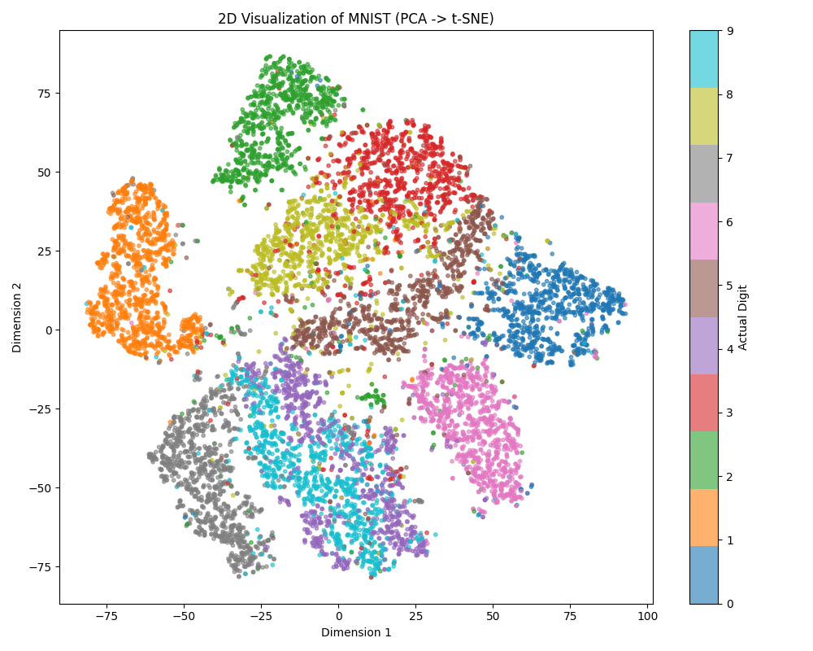
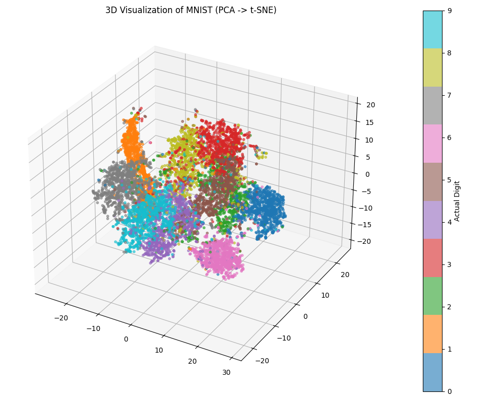
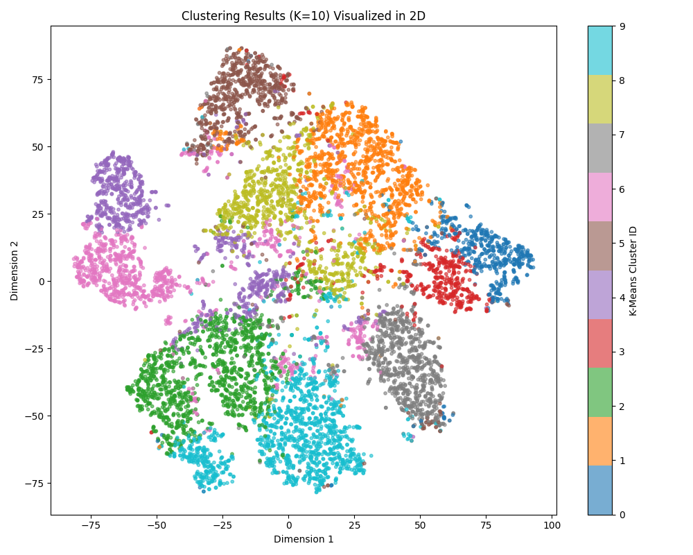

# Unsupervised Learning: การลดมิติและการจัดกลุ่มตัวเลข (MNIST Dataset)

**ประเภท:** [[00_Unsupervised_Learning_MOC|Unsupervised Learning]] > Dimensionality Reduction & Clustering
**โฟลเดอร์:** `01_Unsupervised_MNIST`
**เป้าหมาย:** วิเคราะห์ข้อมูลภาพตัวเลข (784 พิกเซล) แบบ *ไม่มีผู้สอน (ไม่บอกเฉลย)* โดยการลดมิติข้อมูลเพื่อดูโครงสร้าง และให้คอมพิวเตอร์จัดกลุ่มตัวเลขที่หน้าตาคล้ายกันเข้าด้วยกันเอง

---

## 📉 ขั้นตอนที่ 1: การลดมิติข้อมูล (Dimensionality Reduction)

ข้อมูลภาพ MNIST ดั้งเดิมมีขนาด 28x28 = **784 พิกเซล (มิติ)** ซึ่งยากต่อการประมวลผลและการมองเห็น (มนุษย์มองเห็นได้แค่ 2-3 มิติ) เราจึงต้องลดมิติข้อมูลลง:
1. **ลดเหลือ 10 มิติ (ด้วย PCA):** เป็นการดึงแก่นสำคัญ (Principal Components) ของภาพออกมา และตัดสัญญาณรบกวน (Noise) ทิ้ง
2. **ลดเหลือ 2 และ 3 มิติ (ด้วย t-SNE):** เป็นอัลกอริทึมที่เก่งมากในการคลี่ปมข้อมูลที่ซับซ้อนให้แสดงผลเป็นจุดบนกราฟ 2D/3D ได้อย่างสวยงาม

*(หมายเหตุ: ในกราฟด้านล่าง เราแอบนำ "เฉลย (Actual Digit)" มาใส่เป็นสีให้จุดต่างๆ เพื่อให้มนุษย์อย่างเราตรวจสอบว่าโมเดลแยกข้อมูลได้ดีแค่ไหน จะเห็นว่าตัวเลขเดียวกันมักจะเกาะกลุ่มกันเองอย่างชัดเจน)*

### 📊 การแสดงผลใน 2 มิติ (2D Visualization)


### 📊 การแสดงผลใน 3 มิติ (3D Visualization)


---

## 🗂️ ขั้นตอนที่ 2: การจัดกลุ่ม (Clustering)

หลังจากที่เราลดข้อมูลลงเหลือ 10 มิติแล้ว เราจะให้โมเดล **K-Means Clustering** เข้ามาเรียนรู้ โดยเราสั่งแค่ว่า *"ช่วยแบ่งข้อมูลทั้งหมดออกเป็น 10 กลุ่มให้หน่อย (K=10) ตามความคล้ายคลึงของมัน"* โดยที่ **โมเดลไม่รู้เลยว่ามันกำลังดูรูปเลขอะไรอยู่**

### 📊 ผลลัพธ์การจัดกลุ่ม (Clustering Results)
กราฟด้านล่างคือพิกัด 2D เดิม แต่ครั้งนี้ **สีของจุด** คือกลุ่ม (Cluster ID) ที่ K-Means จัดให้ เมื่อเทียบกับรูปแรก จะเห็นว่า K-Means สามารถจัดกลุ่มตัวเลขได้ใกล้เคียงกับความเป็นจริงมาก! แต่อาจจะมีสับสนบ้างในตัวเลขที่เขียนคล้ายกัน เช่น 4 กับ 9 หรือ 3 กับ 8



---

## 💻 ตัวอย่างโค้ด (Python + Scikit-Learn)

โค้ดด้านล่างใช้ข้อมูล 10,000 รูปเพื่อความรวดเร็วในการแสดงผล

```python
import matplotlib.pyplot as plt
import numpy as np
from sklearn.datasets import fetch_openml
from sklearn.decomposition import PCA
from sklearn.manifold import TSNE
from sklearn.cluster import KMeans

# 1. โหลดข้อมูล MNIST และสุ่มมา 10,000 รูป
print("กำลังโหลดข้อมูล...")
mnist = fetch_openml('mnist_784', version=1, as_frame=False)
X, y = mnist.data, mnist.target.astype(int)

np.random.seed(42)
indices = np.random.choice(X.shape[0], 10000, replace=False)
X_sub, y_sub = X[indices], y[indices]

# 2. ลดมิติข้อมูล (Dimensionality Reduction)
print("กำลังลดมิติข้อมูล...")
# ลดเหลือ 10 มิติด้วย PCA (ดึงแก่นสำคัญ)
pca_10 = PCA(n_components=10, random_state=42)
X_pca_10 = pca_10.fit_transform(X_sub)

# ลดเหลือ 2 มิติด้วย t-SNE สำหรับการวาดกราฟ
tsne_2 = TSNE(n_components=2, random_state=42)
X_tsne_2 = tsne_2.fit_transform(X_pca_10)

# 3. จัดกลุ่มด้วย K-Means (Clustering)
print("กำลังจัดกลุ่มข้อมูล (K-Means)...")
kmeans = KMeans(n_clusters=10, random_state=42, n_init=10)
cluster_labels = kmeans.fit_predict(X_pca_10)

# (จากนั้นนำ X_tsne_2 และ cluster_labels ไปวาดกราฟด้วย Matplotlib หรือ Seaborn)
print("เสร็จสิ้น!")
```

## 💡 สิ่งที่ควรทราบ
- การลดมิติก่อนทำ Clustering ช่วยลดปัญหา **Curse of Dimensionality** (เมื่อมิติเยอะเกินไป การวัดระยะห่างระหว่างจุดจะเพี้ยน) และทำให้ K-Means ทำงานได้เร็วและแม่นยำขึ้น
- **t-SNE** เป็นโมเดลที่ดีมากสำหรับการแสดงผล 2D/3D แต่มีข้อเสียคือทำงานช้า จึงนิยมใช้คู่กับ PCA ก่อนเสมอ

#machinelearning #unsupervised #clustering #dimensionality_reduction #mnist #pca #tsne #kmeans
