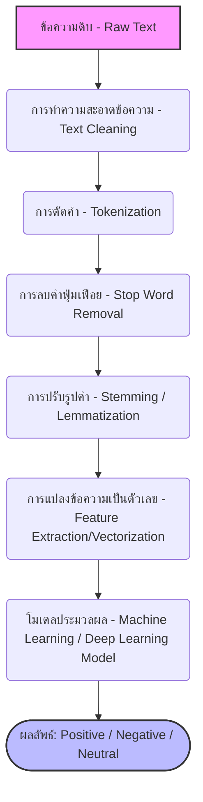

# Sentiment Analysis with NLP

**Sentiment Analysis (การวิเคราะห์ความรู้สึก)** คือกระบวนการที่ใช้ NLP เพื่อระบุอารมณ์ ทัศนคติ หรือความรู้สึกที่ซ่อนอยู่ในข้อความ (มักจะแบ่งเป็น เชิงบวก เชิงลบ หรือเป็นกลาง)

---

## ขั้นตอนการประมวลผล (NLP Pipeline for Sentiment Analysis)

### คำอธิบายแต่ละขั้นตอน:
1. **Text Cleaning (การทำความสะอาดข้อความ):** ลบสัญลักษณ์พิเศษ, เครื่องหมายวรรคตอน, ตัวเลข, HTML Tags หรือ Emoji ที่ไม่จำเป็นต่อการวิเคราะห์
2. **Tokenization (การตัดคำ):** แยกประโยคยาวๆ ออกเป็นคำๆ (Tokens) เพื่อให้คอมพิวเตอร์วิเคราะห์ทีละคำ
3. **Stop Word Removal (การตัดคำหยุด):** ลบคำที่มีความหมายทางไวยากรณ์แต่ไม่ได้ช่วยบ่งบอกอารมณ์ความรู้สึก เช่น "ที่", "ซึ่ง", "อัน", "และ", "is", "am", "are"
4. **Stemming / Lemmatization (การปรับรูปคำ):** แปลงคำที่ถูกผันรูปให้กลับสู่รากศัพท์ 
5. **Feature Extraction (การสกัดฟีเจอร์):** แปลงตัวอักษรให้กลายเป็นตัวเลขที่คอมพิวเตอร์เข้าใจและนำไปคำนวณได้ เช่น TF-IDF หรือ Word Embeddings (Word2Vec, BERT)
6. **Modeling (การสร้าง/ใช้งานโมเดล):** นำชุดตัวเลขเข้าสู่โมเดล (เช่น Naive Bayes, SVM, หรือ Deep Learning) เพื่อจัดหมวดหมู่ความรู้สึก

---

## ความแตกต่างระหว่างภาษาไทยและภาษาอังกฤษ

การทำ Sentiment Analysis ระหว่างสองภาษานี้มีความท้าทายที่แตกต่างกันอย่างชัดเจน ดังนี้ครับ:

| ข้อแตกต่าง | ภาษาอังกฤษ | ภาษาไทย |
| :--- | :--- | :--- |
| **การแบ่งคำ (Tokenization)** | **ง่าย:** สามารถใช้ช่องว่าง (Space) เพื่อแบ่งคำได้เลยทันที | **ท้าทายมาก:** เขียนติดกันเป็นพรืด ไม่มีช่องว่างแบ่งคำ ต้องอาศัยพจนานุกรมหรือโมเดล AI พิเศษ (เช่นไลบรารี PyThaiNLP) ในการสับคำ |
| **การผันรูปคำ (Stemming / Lemmatization)** | **จำเป็น:** มีการเปลี่ยนรูปตาม Tense, พจน์ (เช่น run, running, ran ต้องแปลงให้เหลือแค่คำตั้งต้นคือ run) | **ไม่จำเป็นเท่าไหร่:** ภาษาไทยเป็นภาษาคำโดด ไม่มีการเปลี่ยนรูปคำกริยาตามเวลา แต่จะใช้คำประกอบเอา (เช่น "กำลังกิน", "จะกิน") |
| **โครงสร้างอักขระ (Characters)** | เป็นแบบมิติเดียว (1D) เรียงต่อกันไปซ้ายไปขวา | มีความซับซ้อน (2D) มีสระวางอยู่ข้างหน้า ข้างหลัง ข้างบน ข้างล่าง รวมถึงมีวรรณยุกต์ ทำให้เจอปัญหาพิมพ์ผิดหรือพิมพ์อักขระซ้อนกันบ่อย |
| **ภาษาวิบัติ / แสลงโซเชียล** | มีบ้าง แต่มักเป็นคำย่อหรือตัวพิมพ์สลับที่ | **เปลี่ยนไวและวิเคราะห์ยากมาก:** ชอบลากเสียง หรือ تعمدพิมพ์ผิดเพื่อให้ได้อารมณ์ (เช่น "ม่ายยยยยยย", "ตั้ลล้าก", "ดีย์") ทำให้พจนานุกรมปกติสับคำไม่ออก |
| **บริบทของคำ (Context & Sarcasm)** | มีโครงสร้างไวยากรณ์ที่ชัดเจนในการบอกประโยคปฏิเสธ | มักจะละประธานไว้ในฐานที่เข้าใจ และการประชดประชันบางครั้งดูเหมือนคำชม (เช่น "สวยตายแหละ") ซึ่ง AI ในภาษาไทยยังแยกแยะได้ยากกว่า |
